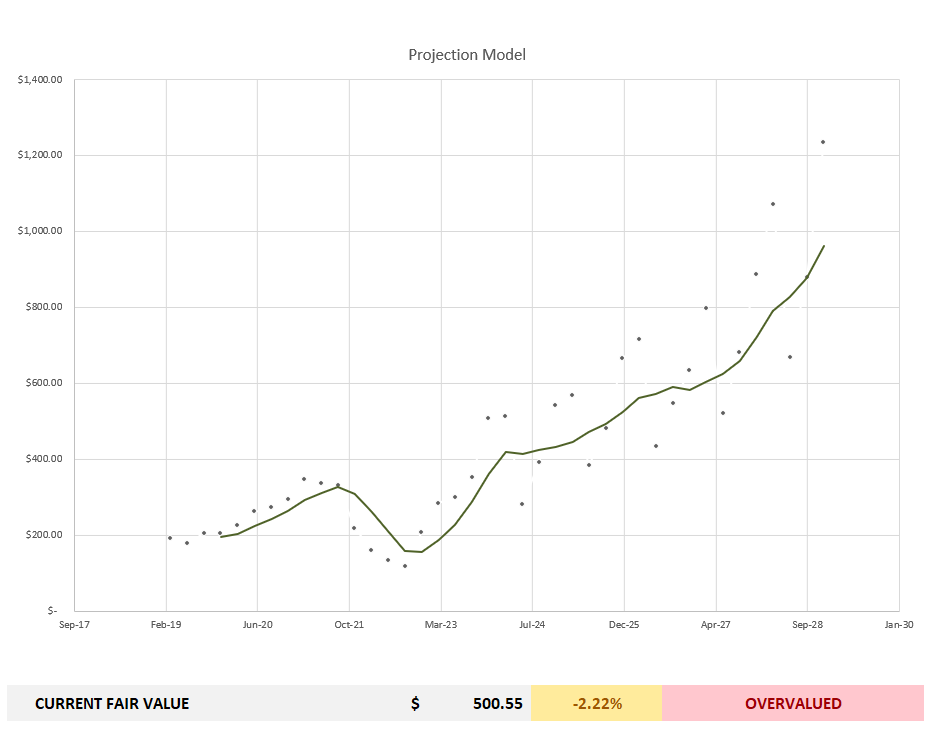

# Datasprint, Inc. | GreenBack Asset Management Software

Portfolio Management & Financial Data Analysis Tool Features:
  - Actively Be Able To Track Your Portfolio
  - Be Able to Import Financial Documents via Python 
    to Excel for Data Analysis & Projection Models
  - Use Built-In Discounted Cash Flow Models

Past 5 Years of Data Imported from (stockanalysis.com)
  - Income Sheet Statement (Quarterly)
  - Balance Sheet Statement (Quarterly)
  - Cash Flow Sheet Statement (Quarterly)
  - Historical Market Capitalization (Quarterly)

Starting the Software:

```
$ cd greenback
$ run app.bat
```

Using Projections Feature (Ex. META):

```
$ D A T A S P R I N T ,  I N C .

$ Enter Option:      
$ - Projections      
$ - Valuations       
$ - Portfolio        

$ Enter Your Choice: projections

$ Projection Option 
$ 2y Model
$ 5y Model

$ Enter Option: 5y  

$ Ticker: meta

$ Accessing 'https://stockanalysis.com/' for Raw Data...
$ Income Sheet Data from 'stockanalysis.com' Added!
$ Balance Sheet Data from 'stockanalysis.com' Added!
$ Cash Flow Sheet Data from 'stockanalysis.com' Added!
$ Stock History Sheet Data from 'stockanalysis.com' Added!

$ Options:
$ - 'Add'
$ - 'View'
$ - 'Edit'
$ - 'Remove'
$ -  Exit

$ Enter your choice: 
```

An Excel Spreadsheet Will Open with the Following Sheets:
- income-sheet
- balance-sheet
- cash-flow-sheet
- stock-history
- condense-sheet
- projections


The 'income-sheet', 'balance-sheet', 'cash-flow-sheet', and 'stock-history'
has the Past 5 Years of Financial Data Imported and Organized Appropriately. 

The 'condense-sheet' Selects Necessary Metrics for the 'projections' Sheet and
Makes Sure the Data is Properly Formatted for Use. 

The 'projections' Sheet Houses all the Calculations and Charts to Show the 
Projections of the Selected Ticker

Projection Model for $META (Meta Platforms Inc)



The Portfolio Option Allows You to Add Positions and Track Prices
- Live Prices from Yahoo Finance
- View Portfolio Statistics

New Updates Coming in May 2024!
  - Will Be Able to Use Model for IPOs (Less Than 5 Years of Financial Data)
  - Will Be Able to Use Data from FRED.gov for Macroeconomic Analysis 
  - PyTorch Libraries Used to Generate More Accurate Projections
    using Equity Data, Macroeconomic Data, and Financial Documents
  - Automatic Portfolio Allocation Algorithm to Help Investors
    Manage and Adjust Positions Each Financial Quarter

Exciting Features in Development Coming Soon!

Written and Developed by Joel Punniaraj
Founder @ Datasprint, Inc.